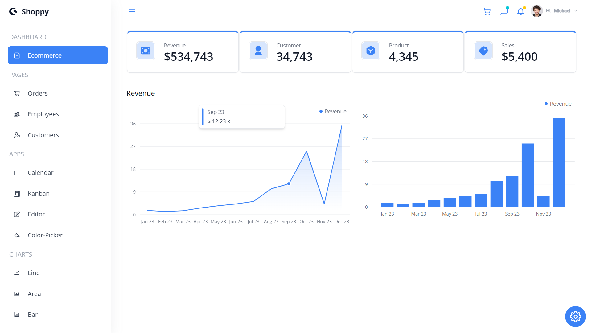

# React Admin Dashboard

## Description

This is a simple Admin Dashboard web application built with React. It allows users to gain insight into their Ecommerce growth through various data visualization tools.


## Getting Started

To get a local copy up and running follow these simple steps:

1. Clone the repository:

   ```bash
   git clone https://github.com/Rithrita-Kong/React-Admin-Dashboard.git
   ```

2. Navigate into the project directory:

   ```bash
   cd React-Admin-Dashboard
   ```

3. Install dependencies:

   ```bash
   npm install
   ```

4. Start the development server:

   ```bash
   npm start
   ```

5. Open your browser and go to `http://localhost:3000` to view the app.

## Features

- Area Chart & Bar Chart for Revenue
- Cards Display for Sale Metrics
- Navigation Bar
- Profile Management
- Chat Interface
- Notification Center
- Shopping Cart
- Customizable Theme Color

## Credits

This project utilizes various open-source libraries and frameworks, including React and Tremor. We express our gratitude to the developers and contributors of these projects for their valuable contributions.

## License

This project is licensed under the MIT License. See the LICENSE file for more details.
